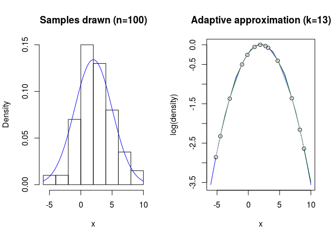

<!-- README.md is generated from README.Rmd. Please edit that file -->
adsample: Fast Adaptive Rejection Sampling
==========================================

[](https://travis-ci.org/kuperov/adsample) [](https://codecov.io/github/kuperov/adsample?branch=master)

This package implements the adaptive rejection sampling described by [Gilks & Wild (1992)](http://www.jstor.org/stable/2347565). It is implemented in C++. *It is still under development, and not ready for general use.*

The algorithm works well for densities that are expensive to compute, where sampling from an empirical distribution function (as in griddy Gibbs) would be computationally expensive.

The algorithm can sample from any univariate log concave densities. This is a large number of densities (especially if you allow minor reparameterizations) but is not all of them. See the paper!

Example
=======

In this contrived example, we draw 1,000 variates from the truncated normal distribution Normal(2, 3^2; -10, 10). We first specify an R function that computes the log density and its derivative:

``` r
# log density and derivative function
h <- function(x) {
  y <- - 1/18*(x-2)^2
  yprime <- -(x - 2)/9
  c(y, yprime)
}
```

And now we call `adsample` to sample 100 variates. We need to provide two initial points within the support of *f* to seed the algorithm, and the bounds of its support.

``` r
library(adsample)
set.seed(123)
xs <- adsample(n = 100, log_dens = h, initialPoints = c(-1, 1), minRange = -10,
               maxRange = 10)
plot(density(xs), 'X ~ Normal(2, 3^2; -10, 10)', col='red')
true.dens <- function(x) dnorm(x, 2, 3)/(1-2*pnorm(-10, 2, 3))
curve(true.dens, -10, 10, add=TRUE, col='blue')
legend('topleft', c('Kernel density', 'True density'), col=c('red','blue'), lty=1)
```


To see what the algorithm is doing, we can run it in debug mode and use the `plot` method to display the algorithm's internal state.

``` r
set.seed(123)
dbg <- adsample(n = 100, log_dens = h, initialPoints = c(-1, 1), minRange = -10,
               maxRange = 10, debug = TRUE)
plot(dbg)
```



This plot nicely shows the upper and lower hulls (green and gray, respectively) for the log density the algorithm computes. Notice that, even though we drew 100 variates, there were far fewer evaluations of *h*(*x*) (denoted by circles).
